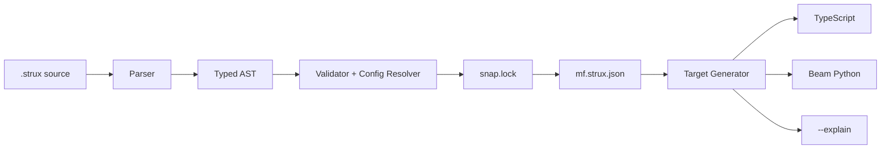

<!--  -->

# Openstrux

**Structure first. Code second. Trust built in.**

**Designed for AI:** Openstrux is a standard for AI-native software. It centers on a compact structured language that frontier LLMs can use directly — no fine-tuning, no custom grammars, no project-specific training. The notation is token-efficient by design: models spend context on meaning, structure, and intent instead of boilerplate, which improves generation quality, cost, and performance.

**Controlled by Humans:** Security, data privacy, intent, and access controls are built into the source itself. Reusable components carry their policy boundaries and trust metadata across projects. Complete systems can be reviewed, audited, and certified directly from source and lock state.

**Regulation built-in:** Privacy, traceability, and compliance are embedded in the source — not added later through middleware, documentation, or compliance spreadsheets. Openstrux supports GDPR, the EU AI Act, and similar regulatory frameworks out of the box, so meeting those requirements takes no extra effort and can be easily demonstrated and certified.

---

## Why Openstrux?

AI generates software faster than humans can review it. But most generated output arrives as verbose framework code with weak structure, unclear intent, and no built-in evidence for trust.

Openstrux addresses this at the language level. The primary artifact is a compact system definition designed for machines — no boilerplate, no human-oriented ceremony. LLMs generate it efficiently, tooling validates it, and the generated code is a derived view, not the source of truth. The result is faster generation, lower token cost, and stronger structure.

Human and regulatory controls live in the same source but stay out of the generation path. Purpose-bound access, data separation, retention rules, traceability, and certification scope are declared once, enforced in validation, and surfaced on demand for audits or reviews — without slowing down code generation. Certified components move between projects with their interfaces, boundaries, and trust metadata intact.

The building metaphor is inspired by the classic "Construx" construction set: simple typed pieces that snap together into larger structures with clear boundaries.

---

## Core Principles

- **AI-native** — standard frontier LLMs generate valid Openstrux artifacts directly, without fine-tuning or project-specific grammar training. The same prompts work across multiple model families.
- **Token- and cost-efficient** — compact vocabulary, short aliases, minimal boilerplate. Target median source-to-generated-code ratio: 0.25 or lower.
- **Certified by design** — reusable components carry explicit security, privacy, and usage boundaries, and keep their interfaces, version, content hash, and trust metadata when composed into larger systems or shared across projects. Builds and audits fail when a system operates outside declared scope.
- **Human-translatable on demand** — the same source and lock state produce deterministic, byte-identical output on every build, including code, explanations, and engineer-readable views.
- **Built for performance** — generated targets are benchmarked for build time and runtime behavior, not only for correctness.
- **Structure first. Code second.** — structured source is canonical; generated code is reproducible output.
- **Trust built in. Not bolted on.** — audit outputs, lineage, and compliance-relevant metadata come from the same source artifact.

See [MANIFESTO_OBJECTIVES.md](MANIFESTO_OBJECTIVES.md) and [MANIFESTO_BENCHMARKS.md](MANIFESTO_BENCHMARKS.md) for the measurable review criteria and release thresholds.

---

## How It Works



The flow is simple by design: define the system once as structured source, validate it once with policy-aware checks, lock it once for deterministic rebuilds, and generate multiple targets from the same trusted base.

The core language stays small. Most examples become readable once you understand four constructs: `type` for data definitions, `rod` for typed processing units, `knot` for typed connections, and `panel` for the top-level runnable slice.

```strux
type Proposal record
  id: uuid
  title: string
  budget: number

rod pseudonymize in: ApplicantRecord -> out: AliasRecord
knot when eligible: expr -> review-queue

panel intake-pipeline
  access
    principal: Reviewer
    intent: read-blinded
    scope: BlindedPacket
```

That compact form is also what the validator checks. It gives the validator enough structure to verify typed composition, certification context, determinism, and policy-aware generation — before any target code exists.

---

## Repository Map

| Repo                                                                                    | Purpose                                                                 | Status  |
| --------------------------------------------------------------------------------------- | ----------------------------------------------------------------------- | ------- |
| [openstrux](https://github.com/openstrux/openstrux)                                     | Manifesto, governance, benchmarks, and demo material                    | Active  |
| [openstrux-spec](https://github.com/openstrux/openstrux-spec)                           | Normative language specification                                        | Alpha   |
| [openstrux-core](https://github.com/openstrux/openstrux-core)                           | Parser, validator, lock, manifest, explanation, and target generation   | Alpha   |
| [openstrux-uc-grant-workflow](https://github.com/openstrux/openstrux-uc-grant-workflow) | A privacy-first grant-workflow use case — MVP demo and benchmark target | Active  |
| `openstrux-hub`                                                                         | Planned catalog of certified, reusable Openstrux components             | Planned |

The long-term role of `openstrux-hub` is to make certification and reuse practical at component level, so teams can assemble systems from trusted building blocks instead of re-proving the same guarantees from scratch.

---

## MVP Demo

The MVP demonstrates Openstrux on a privacy-first blinded review workflow. Its goal is not to replace human reviewers, but to show that a compact structured source can generate secure application behavior, strong access controls, auditable workflows, and benchmark-ready outputs.

The demo compares two execution paths over the same initialized target and task set. One path uses direct prompt-driven generation without Openstrux, and the other adds an Openstrux layer before generation so both can be compared on the same prompts, functional slices, validation rules, token counts, and execution measures.

What matters here is evidence, not just architecture. The benchmark suite measures syntax validity, semantic validity, token efficiency, deterministic translation, certification and audit behavior, human-readable translation, and performance against fixed thresholds.

---

## Quickstart

> Alpha note: the CLI commands below work; some flags and workflows are still being stabilized.

```bash
git clone https://github.com/openstrux/openstrux-core
cd openstrux-core
pnpm install

pnpm openstrux validate examples/intake-pipeline.strux
pnpm openstrux generate --target ts examples/intake-pipeline.strux
pnpm openstrux generate --explain examples/intake-pipeline.strux
```

For the MVP demo:

```bash
git clone https://github.com/openstrux/openstrux-uc-grant-workflow
cd openstrux-uc-grant-workflow
```

---

## Contributing

Contributions are welcome across language design, compiler implementation, benchmark design, and demo work. Good entry points include parser and generators in `openstrux-core`, new use-cases in their own repos, and syntax and conformance improvements in `openstrux-spec`.

See [CONTRIBUTING.md](CONTRIBUTING.md) and [governance/](governance/).

---

## License

[MIT](LICENSE)
